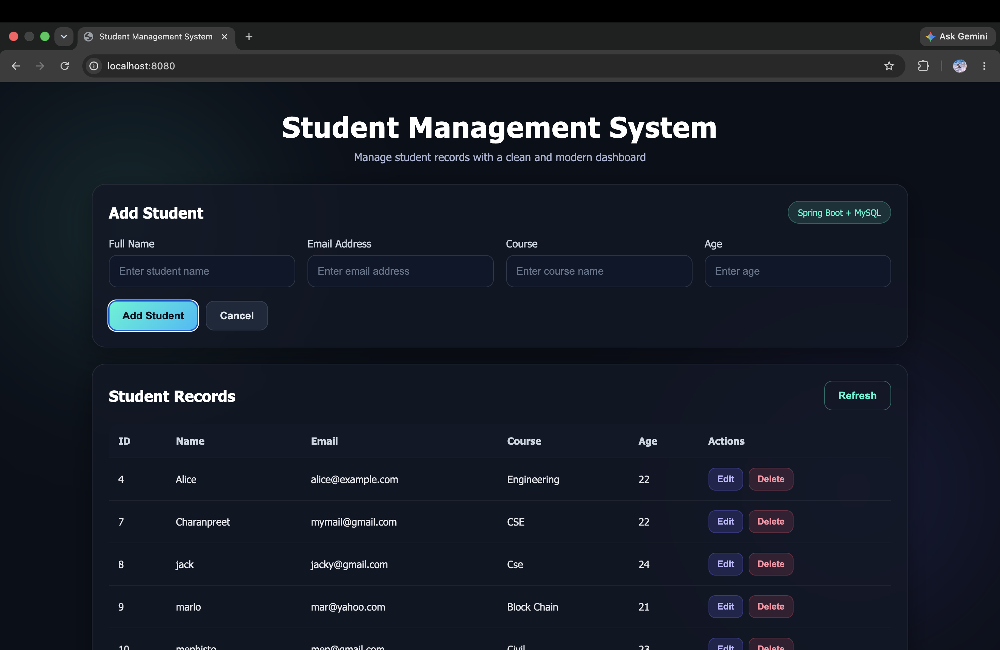

<div align="center">

<br/>


<br/><br/>

# 🎓 Student Management System

### Full-Stack Web Application · Spring Boot + MySQL + REST API

**A complete CRUD-based Student Management System built with Java, Spring Boot, and MySQL.**  
Manage student records effortlessly through a clean, responsive dark-themed UI backed by a layered RESTful architecture.

<br/>

[](https://github.com/charanpreetSingh123/student-management-system-spring-boot)

<br/>

</div>

---

## ✨ Features

| Feature | Description |
|---|---|
| ➕ **Add Students** | Create new student records with name, email, and course details |
| 📋 **View All Students** | Display all records in a clean, structured table with real-time data |
| ✏️ **Update Records** | Edit and update existing student information instantly |
| 🗑️ **Delete Records** | Remove student entries with confirmation handling |
| 🔌 **REST API** | Full CRUD API endpoints testable via Postman |
| 🗄️ **MySQL Integration** | Persistent data storage with Spring Data JPA + Hibernate ORM |
| 🌙 **Dark-Themed UI** | Responsive, modern dark interface built with HTML, CSS, JS |
| 🏗️ **Layered Architecture** | Clean separation — Controller → Service → Repository → Entity |
| ⚠️ **Exception Handling** | Custom exception classes for meaningful API error responses |

---

## 🛠️ Tech Stack

```
┌──────────────────┬───────────────────────────────────────────────────────────┐
│  Layer           │  Tools                                                    │
├──────────────────┼───────────────────────────────────────────────────────────┤
│  Backend         │  Java · Spring Boot · Spring Web · Spring Data JPA        │
│  ORM             │  Hibernate (via Spring Data JPA)                          │
│  Frontend        │  HTML · CSS · JavaScript (Vanilla)                        │
│  Database        │  MySQL                                                    │
│  Build Tool      │  Maven                                                    │
│  API Testing     │  Postman                                                  │
│  IDE             │  IntelliJ IDEA · Spring Tool Suite · VS Code              │
└──────────────────┴───────────────────────────────────────────────────────────┘
```

---

## 🏗️ Architecture Overview

```
┌─────────────────────────────────────────────────┐
│                   Frontend                       │
│         HTML · CSS · JavaScript                  │
│   (Fetch API calls to Spring Boot backend)       │
└────────────────────┬────────────────────────────┘
                     │  HTTP / REST
┌────────────────────▼────────────────────────────┐
│              Controller Layer                    │
│         StudentController.java                   │
│    Handles HTTP requests, maps endpoints         │
└────────────────────┬────────────────────────────┘
                     │
┌────────────────────▼────────────────────────────┐
│               Service Layer                      │
│          StudentService.java                     │
│    Business logic, validation, orchestration     │
└────────────────────┬────────────────────────────┘
                     │
┌────────────────────▼────────────────────────────┐
│             Repository Layer                     │
│        StudentRepository.java                    │
│    Spring Data JPA — extends JpaRepository       │
└────────────────────┬────────────────────────────┘
                     │  JPA / Hibernate
┌────────────────────▼────────────────────────────┐
│               MySQL Database                     │
│           students table                         │
└─────────────────────────────────────────────────┘
```

---

## 📡 REST API Endpoints

| Method | Endpoint | Description |
|---|---|---|
| `GET` | `/api/students` | Fetch all student records |
| `GET` | `/api/students/{id}` | Fetch a student by ID |
| `POST` | `/api/students` | Create a new student |
| `PUT` | `/api/students/{id}` | Update an existing student |
| `DELETE` | `/api/students/{id}` | Delete a student by ID |

> Test all endpoints using **Postman** or the built-in browser UI at `http://localhost:8080`

---

## 📂 Project Structure

```
student-management-system-spring-boot/
│
├── src/
│   ├── main/
│   │   ├── java/
│   │   │   └── com/charanpreet/studentmanagementsystem/
│   │   │       ├── controller/
│   │   │       │   └── StudentController.java     # REST endpoints
│   │   │       ├── entity/
│   │   │       │   └── Student.java               # JPA entity / data model
│   │   │       ├── repository/
│   │   │       │   └── StudentRepository.java     # Spring Data JPA repository
│   │   │       ├── service/
│   │   │       │   └── StudentService.java        # Business logic layer
│   │   │       ├── exception/
│   │   │       │   └── ResourceNotFoundException.java  # Custom exception handling
│   │   │       └── StudentManagementSystemApplication.java
│   │   │
│   │   └── resources/
│   │       ├── static/
│   │       │   ├── index.html                     # Main UI page
│   │       │   ├── style.css                      # Dark theme styling
│   │       │   └── script.js                      # Fetch API + DOM logic
│   │       └── application.properties             # DB config, server port
│   │
│   └── test/
│       └── ...                                    # Unit tests
│
├── pom.xml                                        # Maven dependencies
├── .gitignore
└── README.md
```

---

## ⚙️ Getting Started

### Prerequisites

- Java 17+
- Maven 3.8+
- MySQL 8.0+
- IntelliJ IDEA / VS Code / Spring Tool Suite

---

### 1. Clone the repository

```bash
git clone https://github.com/charanpreetSingh123/student-management-system-spring-boot.git
cd student-management-system-spring-boot
```

### 2. Set up the MySQL database

```sql
CREATE DATABASE student_management_db;
```

### 3. Configure `application.properties`

```properties
spring.datasource.url=jdbc:mysql://localhost:3306/student_management_db
spring.datasource.username=your_mysql_username
spring.datasource.password=your_mysql_password

spring.jpa.hibernate.ddl-auto=update
spring.jpa.show-sql=true
spring.jpa.properties.hibernate.dialect=org.hibernate.dialect.MySQL8Dialect

server.port=8080
```

### 4. Build and run the project

```bash
mvn clean install
mvn spring-boot:run
```

### 5. Open the app

```
http://localhost:8080
```

---

## 🧪 API Testing with Postman

**Create a student** — POST `/api/students`
```json
{
  "firstName": "Charanpreet",
  "lastName": "Singh",
  "email": "charanpreet@example.com"
}
```

**Update a student** — PUT `/api/students/1`
```json
{
  "firstName": "Charan",
  "lastName": "Singh",
  "email": "charan.updated@example.com"
}
```

**Delete a student** — DELETE `/api/students/1`
```
Returns: 200 OK with success message
```

---
## 📸 Screenshots

### 🏠 Dashboard


---

## 🌱 What This Project Demonstrates

```
✅  Spring Boot REST API design with full CRUD operations
✅  Spring Data JPA with Hibernate ORM and MySQL integration
✅  Layered architecture — Controller, Service, Repository, Entity
✅  Custom exception handling for clean API error responses
✅  Frontend-backend integration using Fetch API (no frameworks)
✅  Responsive dark-themed UI with HTML, CSS, and vanilla JS
✅  Maven project structure and dependency management
✅  Postman-based API testing workflow
```

---

## 🔖 Version

| Version | Description |
|---|---|
| `v1.0.0` | Initial release — full CRUD, REST API, MySQL, dark UI |

---

## 👤 Author

**Charanpreet Singh**  
B.Tech CSE — CGC University Mohali

[](https://github.com/charanpreetSingh123)

---

<div align="center">

**Built with Java · Spring Boot · MySQL · Love for Clean Architecture**

<br/>

*Found this useful? Give it a ⭐ on GitHub!*

</div>